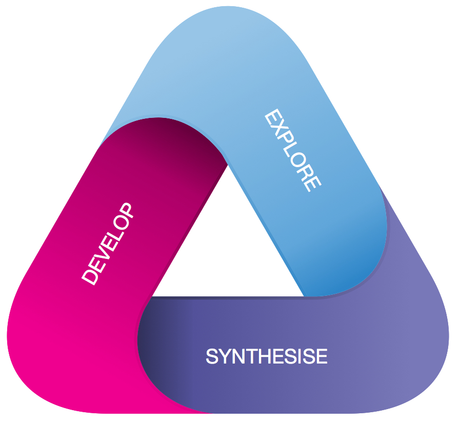

# Phases

Design Thinking draws from the designer's toolbox for non-typical design contexts, like business strategy or social innovation. As an approach to innovation, it combines [_exploring problems_, _building empathy_ and _prototyping solutions_](http://www.jonkolko.com/writingDesignThinking.php)_._ This combination maps well to the challenges in platforming:

* \*\*\*\*[**EXPLORE**](../design-phases/ecosystem-exploration.md) the ecosystem to design for. The people, organisations and things acting in context, and the trends and forces as they surface in that context. Gather data without judgement and build understanding.
* \*\*\*\*[**SYNTHESISE**](../design-phases/platform-synthesis.md) actionable insights from the data gathered. Identify reoccurring problems, expose unexpressed needs and uncover sought after convenience. Capture and prioritise these in a platform model.
* \*\*\*\*[**DEVELOP**](../design-phases/platform-development.md) validating solutions. Deconstruct the platform model into its hypotheses and bring it to life with a series of pass/fail tests to run in front of the envisioned platform participants. Build, measure, learn.

The process is non-prescriptive and its three phases are wholly complementary. Each phase feeds into the next, and each sets clear boundaries for the others. Each phase also leverages a different and established discipline: 

* [Strategic Design](https://en.wikipedia.org/wiki/Strategic_design) **to explore** internal resources and capabilities, and external trends and forces.
* [Service Design](https://en.wikipedia.org/wiki/Service_design) __**to synthesise** a point of view with qualitative research and ideation techniques. 
* \_\_[Customer Development](https://en.wikipedia.org/wiki/Customer_development) **to develop** solutions in search of a repeatable and scalable platform business.

The clear separation of phases allows for this usage without atom-smashing the disciplines into one [convoluted](https://www.researchgate.net/figure/Suggested-model-of-lean-design-thinking-Adaption-and-merging-of-promising-aspects-of_fig2_234066097), [confused](https://cdn-images-1.medium.com/max/1600/1*St0mcTsgm7l_onVGFJUK5Q.png) process. This is a key and discerning advantage of FAST.

